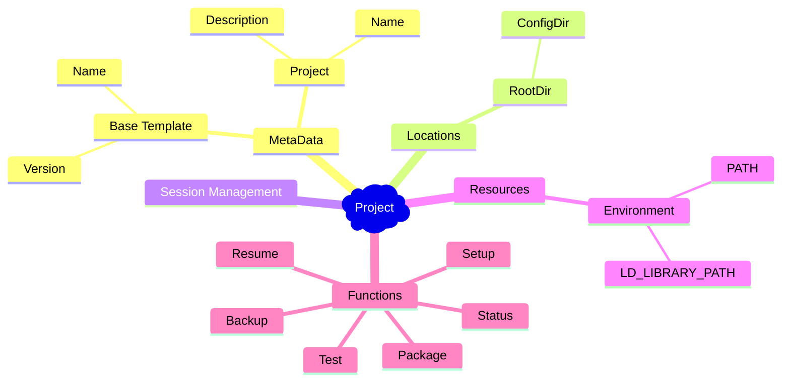

# Structure

```mermaid
mindmap
  root)Project(
    MetaData
      Base Template
        Name
        Version
      Project
        Name
        Description
    Locations
      RootDir
        ConfigDir
    Session Management
    Resources
      Environment
        PATH
        LD_LIBRARY_PATH
    Functions
      Setup
      Status
      Backup
      Resume
      Package
      Test
```

## Locations

* ``RootDir``: Root of the project

## MetaData

Store
