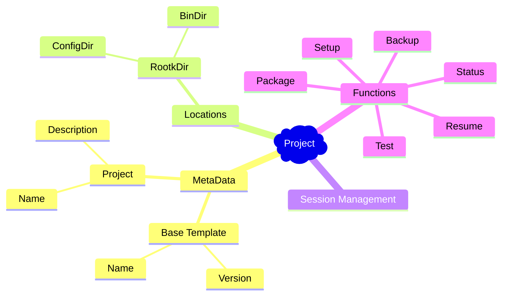

# Structure

```mermaid
%%{init: {'theme': 'dark', "flowchart" : { "curve" : "basis" } } %}%%
mindmap
  root)Project(
    MetaData
      Base Template
      ::icon(fa fa-file)
        Name
        Version
      Project
      ::icon(fa fa-file)
        Name
        Description
    Locations
      RootkDir
        BinDir
        ConfigDir
    Session Management
    Functions
      Setup
      ::icon(fa fa-gear)
      Status
      ::icon(fa fa-gear)
      Backup
      ::icon(fa fa-gear)
      Resume
      ::icon(fa fa-rocket)
      Package
      Test
```
