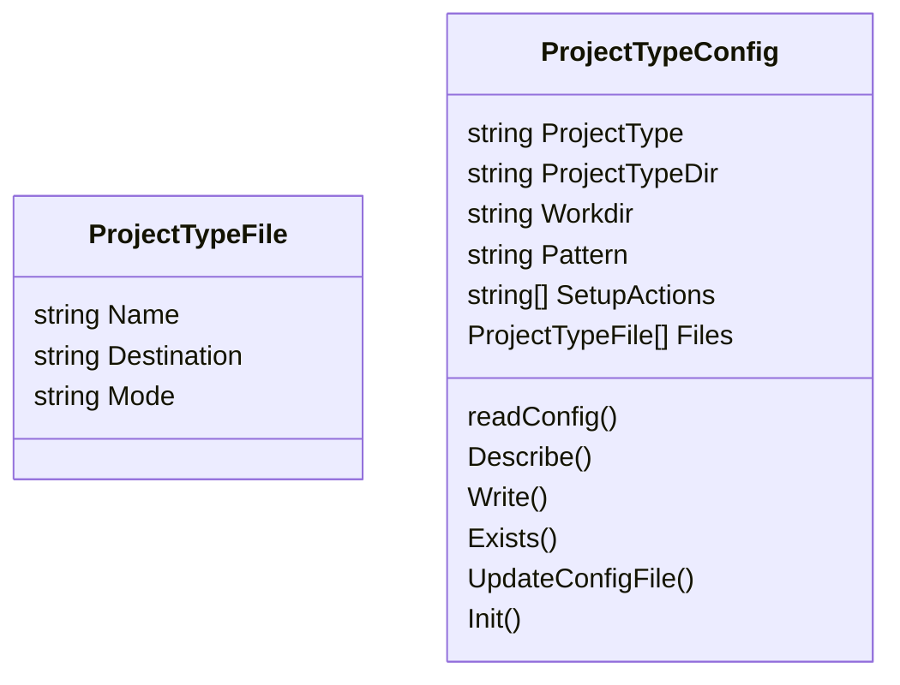

```mermaid
classDiagram
    class ProjectTypeFile{
        string Name
        string Destination
        string Mode
    }

    class ProjectTypeConfig{
        string ProjectType
        string ProjectTypeDir
        string Workdir
        string Pattern
        string[] SetupActions
        ProjectTypeFile[] Files

        readConfig()
        Describe()
        Write()
        Exists()
        UpdateConfigFile()
        Init()
    }


```
